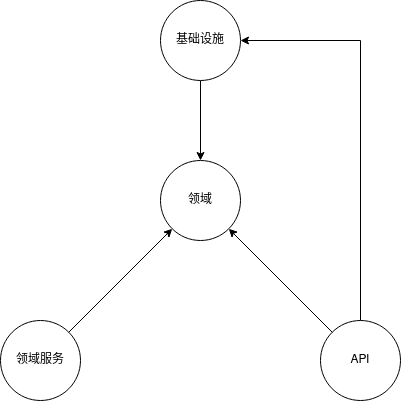

# 计费系统

该项目是**计算编排系统**的计费领域微服务，负责计算用户使用计算编排系统时产生的费用。


## 架构

本项目采用**领域驱动设计**思想，并参考微软的 *Rust洋葱架构项目* [^Cookiecutter]，
旨在减少模块间的耦合度，提高模块内的内聚性。

```
.
├── api             用户接口层
│  ├── controller   控制器，网络通信接口
│  └── dto          数据传输对象
├── domain              领域层
│  ├── models           业务模型
│  ├── repositories     业务仓储的抽象
│  └── services         服务的抽象
├── infrastructure          基础设施层
│  ├── databases            数据库的适配器
│  ├── repositories         业务仓储的具体实现
│  ├── services             外部服务
│  └── service_provider     依赖注入的供给方
├── services    业务服务的具体实现
└── server  服务器配置
```

<p align="center" >
  
</p>


## 参考

[^Cookiecutter]: https://github.com/microsoft/cookiecutter-rust-actix-clean-architecture
